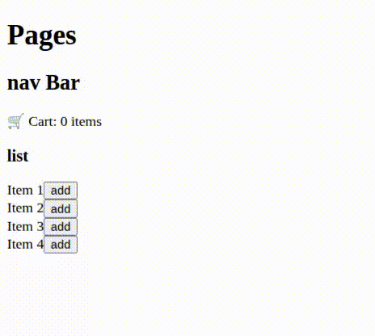

# 🛒 React Cart with Context API  

## 📌 Project Description  
This project is a simple practice to understand and learn **Context API in React**.  
Using Context, we implemented a basic shopping cart where the user can increase the number of items in the cart by clicking the **Add** button.  

This exercise was mainly a preparation for learning **state management** and tools like **Redux Toolkit**.  

---

## 🏗️ Project Structure  

- **Pages** → Provides Context and renders NavBar & List  
- **NavBar** → Top navigation bar, contains Cart component  
- **Cart** → Displays the number of items in the cart (consumes data from Context)  
- **List** → Renders multiple Item components  
- **Item** → Represents a single product item  
- **AddBtn** → Button to add products to the cart (updates Context state)  

---

## ⚙️ Technologies Used  

- [React](https://react.dev/)  
- Context API  

---

## 🚀 Getting Started  

```bash
# Install dependencies
npm install

# Start the project
npm start
```

The app will be available at `http://localhost:3000`.  

---

## 🎯 Learning Goals  

- Understanding **Context API** and Provider/Consumer pattern in React  
- Managing shared state across multiple components  
- Practicing communication between parent and child components  
- Building a simple **cart functionality**  

---

## 🔍 Improvements & Best Practices  

- Define **TypeScript types** for Context instead of using `null`  
- Use more descriptive naming (e.g., `CartContext` instead of `cartContext`)  
- Extract Context into a separate file (e.g., `CartContext.js`)  
- Add features like decrementing or removing items from the cart  
- Write simple tests for Context and components  

---

## 📸 Preview



---
